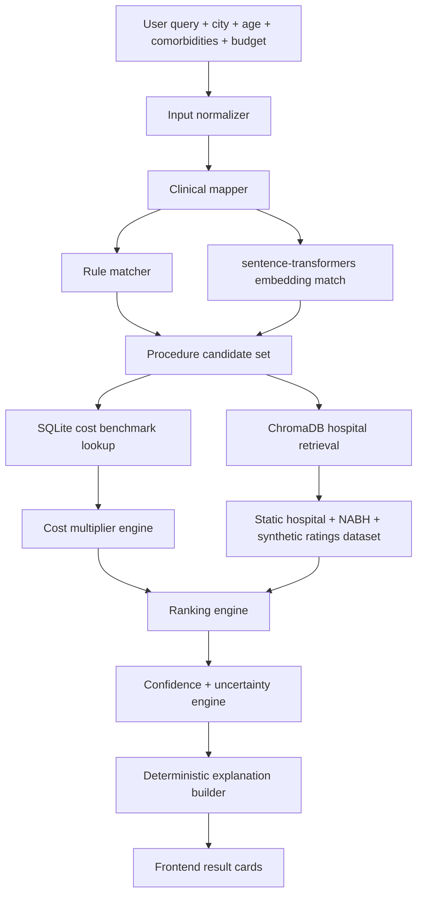

# PS4B Offline-First MVP Specification

## Goal

Build a deterministic hackathon MVP that estimates treatment cost ranges and ranks hospitals without relying on paid or network APIs.

The product does not diagnose. It maps a user-described concern to a likely care pathway for cost planning only, shows uncertainty, and asks for verification with a clinician/hospital before decisions.

## Offline Architecture



## Local Data Stores

### SQLite

Use SQLite for cost and reference data because it is transparent, portable, and deterministic.

Tables:

- `procedures`
  - `procedure_id`
  - `display_name`
  - `condition_label`
  - `icd10_code`
  - `specialty`
  - `complexity`
  - `synonyms_json`
  - `red_flag_terms_json`

- `procedure_benchmarks`
  - `procedure_id`
  - `city_tier`
  - `component`
  - `min_inr`
  - `max_inr`
  - `source_type`
  - `source_confidence`

- `city_tiers`
  - `city`
  - `tier`
  - `cost_multiplier`

- `multipliers`
  - `factor`
  - `component`
  - `condition`
  - `multiplier`

### ChromaDB

Use ChromaDB embedded mode for local retrieval over hospital specialization descriptions.

The hackathon dataset lives in `data/hospitals.json` and contains 43 synthetic hospitals across metro, tier-1, tier-2, and tier-3 cities. It is intentionally static so demos are reproducible.

Collection: `hospital_specializations`

Each document:

```json
{
  "hospital_id": "nagpur_orange_city_care",
  "name": "Orange City Care Institute",
  "city": "Nagpur",
  "text": "Orthopedics, cardiology, neurology, knee replacement, joint replacement, trauma care..."
}
```

Metadata:

```json
{
  "city": "Nagpur",
  "nabh": true,
  "rating": 4.5,
  "synthetic_review_score": 0.82,
  "distance_km": 6.1,
  "price_index": 0.98
}
```

### sentence-transformers

Use `all-MiniLM-L6-v2` locally on CPU.

Embeddings are used for:

- User query to procedure semantic match.
- Procedure/specialty to hospital specialization retrieval.

Cache embeddings on disk so repeated runs are deterministic and fast.

## Pipeline

### 1. Input Normalizer

Normalize:

- Lowercase text.
- Extract city.
- Extract age.
- Parse budget to INR integer.
- Parse comorbidities into canonical flags:
  - `diabetes`
  - `hypertension`
  - `cardiac_history`
  - `kidney_disease`
  - `pregnancy`
  - `immunocompromised`

Output:

```json
{
  "query": "knee pain",
  "city": "Nagpur",
  "age": 45,
  "budget_inr": 300000,
  "comorbidities": ["diabetes"],
  "room_type": "general"
}
```

### 2. Clinical Mapper

The mapper does not diagnose. It produces cost-planning candidates.

Use two deterministic signals:

```text
rule_score = exact_alias_match + token_overlap + red_flag_match
embedding_score = cosine(query_embedding, procedure_embedding)
clinical_match_score = 0.55 * embedding_score + 0.45 * normalized_rule_score
```

Candidate selection:

- If top score >= `0.72`: use top procedure.
- If top score between `0.55` and `0.72`: use top procedure but mark medium ambiguity.
- If top score < `0.55`: do not estimate final cost; ask a clarifying question.
- If top 2 scores differ by less than `0.08`: show both candidates or ask a clarifying question.

Output:

```json
{
  "procedure_id": "knee_replacement",
  "procedure": "Knee replacement",
  "condition_label": "Osteoarthritis of knee",
  "icd10_code": "M17.1",
  "specialty": "Orthopedics",
  "clinical_match_score": 0.86,
  "ambiguity_score": 0.14,
  "candidate_type": "cost_planning_match"
}
```

### 3. Cost Estimation

Use SQLite rows from `procedure_benchmarks`.

Required components:

1. Procedure / surgery
2. Doctor fees
3. Room / stay
4. Diagnostics
5. Medicines + contingency

Base range:

```text
component_min = benchmark_min_inr
component_max = benchmark_max_inr
```

Apply deterministic multipliers:

```text
adjusted_component_min = component_min * city_multiplier * age_multiplier * room_multiplier * comorbidity_component_multiplier
adjusted_component_max = component_max * city_multiplier * age_multiplier * room_multiplier * comorbidity_component_multiplier * variability_multiplier
```

Recommended multipliers:

| Factor | Applies To | Multiplier |
| --- | --- | --- |
| Metro city | all components | 1.18 |
| Tier-1 city | all components | 1.05 |
| Tier-2 city | all components | 0.90 |
| Tier-3 city | all components | 0.78 |
| Age 65+ | procedure, room, medicines | 1.15 |
| Diabetes | medicines + contingency | 1.20 |
| Hypertension | diagnostics, medicines | 1.08 |
| Kidney disease | diagnostics, medicines | 1.18 |
| Private room | room / stay | 1.35 |
| ICU likely | room / stay | 2.50 |

Variability:

```text
variability_multiplier = 1 + (0.05 * complexity_level) + (0.04 * comorbidity_count)
```

Where:

- low complexity = 1
- moderate complexity = 2
- major complexity = 3

Total range:

```text
total_min = sum(adjusted_component_min)
total_max = sum(adjusted_component_max)
```

Never output a single price. Always output a range and the component breakdown.

### 4. Hospital Retrieval

Filter first, retrieve second:

```text
city_candidates = hospitals where city == user_city
if city_candidates < 3:
  include nearby/same-tier fallback hospitals
```

Then retrieve with ChromaDB:

```text
query = procedure + specialty + condition_label
top_k = 8
retrieval_score = cosine(query_embedding, hospital_specialization_embedding)
```

### 5. Hospital Ranking Formula

Use deterministic weighted ranking:

```text
final_score =
  0.35 * clinical_fit
  + 0.20 * rating_score
  + 0.15 * accreditation
  + 0.20 * affordability
  + 0.10 * distance_score
```

Sub-scores:

```text
clinical_fit =
  1.00 if requested specialty exactly appears in hospital specialties
  else max(0.35, related_specialty_score)

rating_score = clamp((rating - 3.5) / 1.3, 0, 1)

affordability =
  1.0 if estimated_midpoint <= budget
  else clamp(budget / estimated_midpoint, 0.05, 1.0)

distance_score =
  clamp(1 - distance_km / max_radius_km, 0.05, 1.0)

accreditation =
  1.0 if NABH accredited else 0.45
```

Explainability:

For each hospital, show:

- Top 2 positive score drivers.
- Top 1 tradeoff.
- Cost range.
- NABH flag.
- Confidence note.

Example:

```text
Ranked #1 because it has strong orthopedic match and fits the budget range.
Tradeoff: distance is higher than two alternatives. Verify current availability and exact package price.
```

### 6. Confidence Scoring

Confidence is about data quality, not medical certainty.

```text
confidence =
  0.30 * clinical_mapping_confidence
  + 0.25 * benchmark_coverage
  + 0.20 * hospital_retrieval_confidence
  + 0.15 * data_completeness
  + 0.10 * cost_variability_stability
```

Definitions:

```text
clinical_mapping_confidence = 1 - ambiguity_score
benchmark_coverage = components_found / 5
hospital_retrieval_confidence = average_top_3_retrieval_score
data_completeness = populated_required_fields / required_fields
cost_variability_stability = 1 - normalized_range_width
```

Normalized range width:

```text
range_width = (total_max - total_min) / total_midpoint
normalized_range_width = clamp(range_width / 1.5, 0, 1)
```

Confidence labels:

- `0.80-1.00`: High data confidence
- `0.60-0.79`: Medium data confidence
- `<0.60`: Low data confidence

### 7. Uncertainty Handling

Do not hide uncertainty.

Rules:

- If ambiguity score > `0.45`, show a clarifying question.
- If benchmark coverage < `0.80`, show "limited cost benchmark coverage."
- If fewer than 3 hospitals match, show "limited local provider dataset."
- If range width > `1.2`, show "high cost variability."
- If red-flag symptoms are detected, show urgent-care warning and avoid ranking as if it is routine care.

Clarifying question examples:

- "Is this for a confirmed procedure or only symptoms?"
- "How long has the symptom been present?"
- "Has a doctor already recommended surgery?"
- "Do you need general room, private room, or ICU estimate?"

### 8. Medical Safety Disclaimer

Every result must include:

```text
This tool does not diagnose, prescribe, or recommend a hospital for emergency care.
It estimates likely cost ranges from offline benchmark data and ranks providers using static/synthetic data.
Confirm diagnosis, urgency, availability, and final pricing with a licensed clinician and the hospital.
```

For red flags:

```text
Urgent symptom warning: if symptoms are severe, sudden, or worsening, seek emergency medical care immediately instead of using this estimate for decision-making.
```

## Example Input To Output Flow

Input:

```json
{
  "query": "knee pain, Nagpur, 45yo, diabetic",
  "city": "Nagpur",
  "age": 45,
  "budget_inr": 300000,
  "room_type": "general",
  "comorbidities": ["diabetes"]
}
```

Step 1: Normalization

```json
{
  "query": "knee pain",
  "city_tier": "tier-1",
  "age_bucket": "adult",
  "comorbidity_flags": ["diabetes"]
}
```

Step 2: Clinical Mapping

```json
{
  "procedure_id": "knee_replacement",
  "procedure": "Knee replacement",
  "condition_label": "Osteoarthritis of knee",
  "icd10_code": "M17.1",
  "specialty": "Orthopedics",
  "ambiguity_score": 0.14,
  "note": "Cost-planning match, not a diagnosis."
}
```

Step 3: Cost Estimate

```json
{
  "total_min_inr": 238000,
  "total_max_inr": 737000,
  "components": [
    {"label": "Procedure / surgery", "min_inr": 114000, "max_inr": 354000},
    {"label": "Doctor fees", "min_inr": 33000, "max_inr": 103000},
    {"label": "Room / stay", "min_inr": 43000, "max_inr": 133000},
    {"label": "Diagnostics", "min_inr": 19000, "max_inr": 59000},
    {"label": "Medicines + contingency", "min_inr": 29000, "max_inr": 88000}
  ],
  "adjustments": ["tier-1 city", "diabetes contingency"]
}
```

Step 4: Hospital Ranking

```json
{
  "top_hospitals": [
    {
      "name": "Orange City Care Institute",
      "score": 0.83,
      "rating": 4.5,
      "cost_category": "mid",
      "cost_range_inr": [233000, 722000],
      "key_strengths": ["strong clinical specialty match", "NABH accredited"],
      "tradeoff": "Approximate distance is the weakest scoring factor"
    },
    {
      "name": "Metro OrthoCare",
      "score": 0.76,
      "rating": 4.4,
      "cost_category": "budget",
      "cost_range_inr": [209000, 649000],
      "key_strengths": ["strong clinical specialty match", "budget cost category"],
      "tradeoff": "NABH not verified in static dataset"
    }
  ]
}
```

Step 5: Confidence

```json
{
  "confidence_score": 0.90,
  "label": "High data confidence",
  "reasons": [
    "All 5 cost components found",
    "Low clinical mapping ambiguity",
    "6 local provider records available"
  ],
  "disclaimer": "No diagnosis. Verify diagnosis, urgency, availability, and final price with a licensed clinician and hospital."
}
```

## Optional Future Scope

Paid/network APIs are not part of the MVP. If added after judging, they must be optional enrichment only, behind feature flags, with local deterministic fallback preserved.
