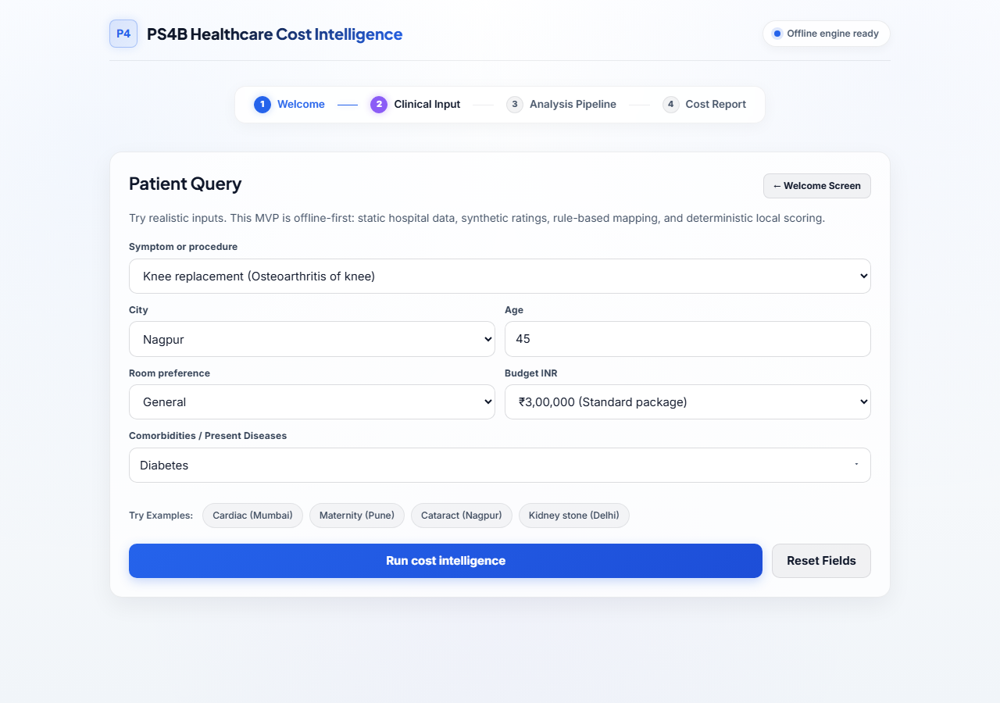
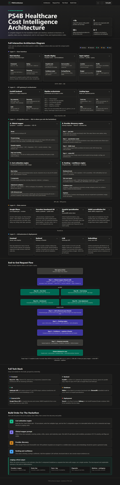

# Healthcare Cost Intelligence

Estimate treatment costs and find ranked hospitals — no internet, no paid APIs, runs entirely on your machine.

Type a symptom or procedure, pick your city, and get a breakdown of expected costs across five billing components, plus a ranked shortlist of hospitals scored on clinical fit, ratings, NABH accreditation, and affordability.

## Quick Start

```powershell
.\run_product.ps1
```

Open `http://127.0.0.1:8765`. No API keys, no pip install, no setup beyond Python.

---

## UI



**Query form inputs:**
- **Symptom or procedure** — dropdown grouped by specialty (50 procedures across 20+ specialties)
- **Example chips** — Cardiac (Mumbai), Maternity (Pune), Cataract (Nagpur), Kidney stone (Delhi)
- **City** — metro through tier-2 Indian cities
- **Age, Room preference, Budget INR**
- **Comorbidities** — multi-select: Diabetes, Hypertension, Cardiac History, Kidney Disease, Stroke

**Results — 3 tabs:**
- **Overview & Costs** — total cost range hero, ICD-10 code, city tier, 5-component breakdown with proportional bar chart
- **Providers** — hospital cards with score, estimated cost ± uncertainty, strengths/tradeoff tags, subscore grid, real-time budget filter slider
- **Clinical & Confidence** — mapped condition, specialty, severity, ambiguity score, confidence matrix

---

## Architecture Diagram



The pipeline runs in 6 deterministic steps:

1. **Input normalizer** — extracts city, age, budget, comorbidities, room type from free text or form
2. **Clinical mapper** — blends token overlap rules (45%) with pre-computed cosine similarity (55%) across 50 procedures
3. **Cost estimation** — SQLite benchmark lookup → multiplier engine (city tier × age × room × comorbidity)
4. **Hospital retrieval** — cosine similarity over pre-computed hospital embeddings, city-match priority
5. **Ranking + confidence** — weighted score per hospital, confidence score based on data completeness and ambiguity
6. **Response assembly** — hospital cards, cost accordion, explanations, disclaimer

No ML runtime. Embeddings were pre-computed with `sentence-transformers/all-MiniLM-L6-v2` and stored as JSON. Cosine similarity runs in pure Python.

---

## Project Statistics

| Metric | Value |
|--------|-------|
| Procedures seeded | 50 across 20+ specialties |
| Hospitals in dataset | 43 (metro, tier-1, tier-2 cities) |
| Cost components per query | 5 (procedure, doctor fees, room/stay, diagnostics, medicines) |
| City tiers covered | 4 (metro, tier-1, tier-2, tier-3) |
| Comorbidity multipliers | 4 (diabetes, hypertension, kidney disease, age 65+) |
| Room type multipliers | 3 (general, private, ICU) |
| Confidence score range | 0–1 (high ≥ 0.75, medium ≥ 0.50, low < 0.50) |
| Server cold start | < 2s (no model load at runtime) |
| External API calls | 0 |
| Runtime dependencies | 0 (stdlib only) |

---

## Ranking Formula

Each hospital gets a composite score from four weighted sub-scores:

```
final_score =
  0.40 × clinical_fit
+ 0.20 × rating_score
+ 0.15 × accreditation
+ 0.25 × affordability
```

**Sub-score definitions:**

| Sub-score | How it's computed |
|-----------|-------------------|
| `clinical_fit` | `1.0` if requested specialty is in hospital's specialty list; else cosine similarity of procedure embedding vs. hospital embedding (floor 0.35) |
| `rating_score` | `clamp((rating − 3.5) / 1.3, 0, 1)` |
| `accreditation` | `1.0` if NABH accredited, `0.45` otherwise |
| `affordability` | `clamp(budget / estimated_mid_cost, 0.05, 1.0)` when budget is set; defaults by cost category otherwise |

**Per-hospital cost index** (breaks identical costs across same-category hospitals):

```
price_index = category_base + (rating − 4.0) / 25 + nabh_bonus
```
Where `category_base` ∈ {0.78 budget, 1.0 mid, 1.24 premium} and `nabh_bonus` = 0.04.

---

## Engineering Challenges

**Identical cost estimates across hospitals**
All hospitals in the same cost category (`budget`/`mid`/`premium`) shared the same flat price multiplier from a pre-built embeddings JSON. Fixed by recomputing `price_index` live at query time from each hospital's rating and NABH status, giving continuous per-hospital variation instead of 3 discrete buckets.

**Stale embeddings cache bypass**
The first attempt at fixing the price index landed in `load_hospitals()` which populates the `HOSPITALS` list — but `discover_hospitals()` iterates over `_hospital_embeddings_cache` loaded from a pre-built JSON file. The fix had to go inside the loop that reads from the cache, not the list loader.

**No ML runtime constraint**
`sentence-transformers` requires PyTorch (~2 GB), which breaks Vercel's 250 MB function limit and adds multi-second cold starts. Solution: pre-compute all embeddings offline and store as compact JSON. Runtime cosine similarity is a 10-line pure Python function.

**Ambiguity without hard rejection**
Queries like "headache" match both migraine and stroke. Rather than erroring, the system blends rule score and embedding score, computes an ambiguity delta between top-2 candidates, and surfaces a clarifying question only when the gap is < 0.08 or score < 0.55.

**Deterministic cost ranges**
A single midpoint estimate is misleading for healthcare. The engine computes an uncertainty band: `uncertainty_fraction = 0.06 + (0.015 × complexity_level) + (0.01 × comorbidity_count)`, then applies it symmetrically around the expected cost midpoint. This keeps ranges narrow for simple procedures and wider for complex or high-comorbidity cases.

---

## Future Roadmap

- **Live price data** — optional enrichment via hospital APIs or CGHS rate card, behind a feature flag
- **Insurance coverage overlay** — map procedures to common policy inclusions/exclusions
- **Geolocation** — auto-detect city from browser, filter by actual driving distance
- **EMR/PDF upload** — extract procedure from discharge summary or prescription
- **Multi-procedure bundles** — estimate combined cost for procedures commonly done together (e.g., cataract + IOL implant)
- **Provider verification link** — direct link to hospital's official quote/inquiry page
- **Trend data** — year-over-year cost movement for common procedures in each city

---

## Dataset

| File | Contents |
|------|----------|
| `data/healthcare_cost.db` | Procedures, cost benchmarks, city tiers, multipliers |
| `data/hospitals.json` | 43 hospital records with specialties and ratings |
| `data/procedure_embeddings.json` | Pre-computed procedure embeddings |
| `data/hospital_embeddings.json` | Pre-computed hospital embeddings |

To regenerate the database:

```powershell
python seed_db.py
```

---

## API Endpoints

| Method | Path | Description |
|--------|------|-------------|
| `GET` | `/health` | Server health check |
| `GET` | `/api/billing-guard` | Confirms no external API calls |
| `GET` | `/api/procedures` | All 50 supported procedures |
| `GET` | `/api/hospitals?city=Nagpur&procedure=knee pain` | Hospitals by city and procedure |
| `POST` | `/api/query` | Main endpoint — cost breakdown + ranked hospitals |

Example request body:

```json
{
  "query": "knee pain, diabetic, 55 years old",
  "city": "Nagpur",
  "age": 55,
  "budget_inr": 300000,
  "room_type": "general",
  "comorbidities": ["diabetes"]
}
```

---

## Notes

- This does not diagnose. It maps your description to a likely care pathway for cost planning only.
- All cost ranges are estimates from benchmark data — actual prices will vary. Always confirm with the hospital.
- Data is static and synthetic. Do not use for emergency triage or clinical decision-making.
