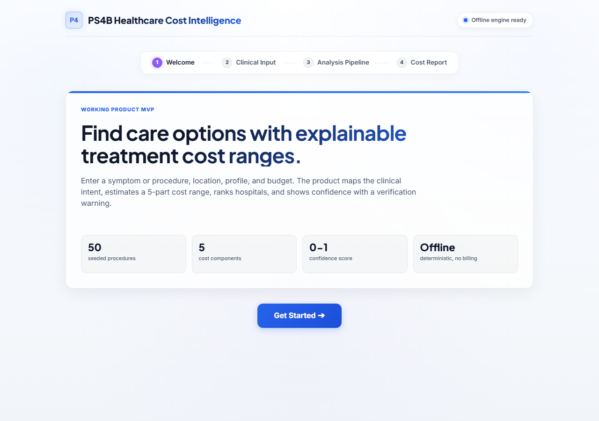
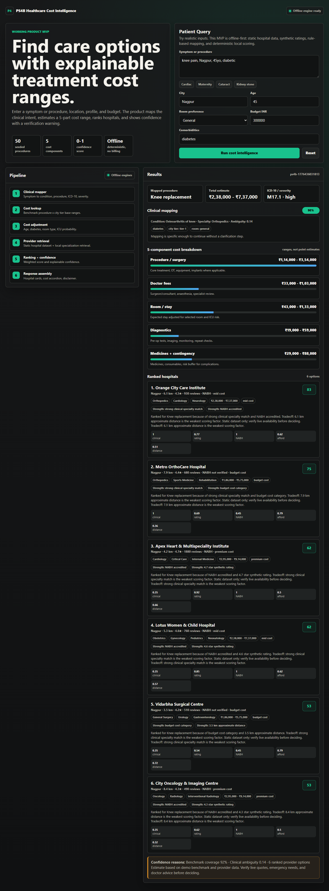

# Healthcare Cost Intelligence

Estimate treatment costs and find ranked hospitals — no internet, no paid APIs, no cloud dependency.

Type a symptom or procedure, pick your city, and get a breakdown of expected costs across five billing components, plus a ranked shortlist of hospitals that match your specialty and budget.



## Quick Start

Clone the repo, then run:

```powershell
.\run_product.ps1
```

Open `http://127.0.0.1:8765` in your browser.

That's it. No API keys, no pip install, no setup beyond having Python available.

## How It Works

The whole pipeline runs locally:

1. **Query parsing** — extracts city, age, and comorbidities from free text
2. **Clinical mapping** — matches your input to one of 50 procedures using token overlap + pre-computed cosine similarity
3. **Cost estimation** — pulls benchmark ranges from SQLite, then applies multipliers for city tier, age, room type, and comorbidities
4. **Hospital ranking** — scores hospitals across clinical fit, rating, NABH accreditation, and affordability
5. **Confidence scoring** — tells you how much to trust the estimate based on data completeness and query ambiguity

No ML libraries are needed at runtime. Embeddings were pre-computed with `sentence-transformers/all-MiniLM-L6-v2` and stored as JSON. Cosine similarity runs in pure Python.

## What's Included

- 50 procedures across 20+ specialties (orthopedics, cardiology, oncology, obstetrics, etc.)
- 43 hospitals across metro, tier-1, and tier-2 Indian cities
- City-tier cost multipliers (metro through tier-3)
- Comorbidity adjustments for diabetes, hypertension, and kidney disease
- Room-type adjustments (general, private, ICU)
- NABH accreditation flags and synthetic ratings
- Confidence score with plain-English explanation

## Dataset

| File | Contents |
|------|----------|
| `data/healthcare_cost.db` | Procedures, cost benchmarks, city tiers, multipliers |
| `data/hospitals.json` | 43 hospital records with specialties and ratings |
| `data/procedure_embeddings.json` | Pre-computed procedure embeddings |
| `data/hospital_embeddings.json` | Pre-computed hospital embeddings |

To regenerate the database from scratch:

```powershell
python seed_db.py
```

## API Endpoints

| Method | Path | Description |
|--------|------|-------------|
| `GET` | `/health` | Server health check |
| `GET` | `/api/billing-guard` | Confirms no external API calls are made |
| `GET` | `/api/procedures` | Lists all 50 supported procedures |
| `GET` | `/api/hospitals?city=Nagpur&procedure=knee pain` | Hospitals filtered by city and procedure |
| `POST` | `/api/query` | Main query endpoint — returns cost breakdown and ranked hospitals |

Example query:

```json
{
  "query": "knee pain, diabetic, 55 years old",
  "city": "Nagpur",
  "age": 55,
  "budget_inr": 300000,
  "room_type": "general",
  "comorbidities": ["diabetes"]
}
```

## Architecture


## Screenshots

| Query form | Results with hospital dataset |
|---|---|
|  |  |

## Notes

- This does not diagnose. It maps your description to a likely care pathway for cost planning only.
- All cost ranges are estimates from benchmark data — actual prices will vary. Always confirm with the hospital.
- Data is static and synthetic. Do not use for emergency triage or clinical decision-making.
