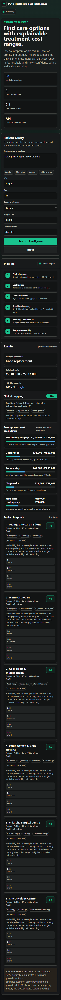

# Healthcare Cost Intelligence

Estimate treatment costs and find ranked hospitals — no internet, no paid APIs, runs entirely on your machine.

Type a symptom or procedure, pick your city, and get a breakdown of expected costs across five billing components, plus a ranked shortlist of hospitals scored on clinical fit, ratings, NABH accreditation, and affordability.

## Quick Start

```powershell
.\run_product.ps1
```

Open `http://127.0.0.1:8765`. No API keys, no pip install, no setup beyond Python.

---

## UI Overview

### Query Form


The left panel shows the 6-step processing pipeline in real time. The right panel has the query form:

- **Symptom or procedure** — dropdown grouped by specialty (50 procedures across 20+ specialties)
- **Example chips** — Cardiac (Mumbai), Maternity (Pune), Cataract (Nagpur), Kidney stone (Delhi)
- **City** — metro through tier-2 Indian cities
- **Age, Room preference, Budget INR**
- **Comorbidities** — multi-select: Diabetes, Hypertension, Cardiac History, Kidney Disease, Stroke

### Results — 3 tabs


**Overview & Costs**
- Total cost range as the hero figure
- ICD-10 code and city tier context
- 5-component cost breakdown with proportional bar chart:
  - Procedure / surgery
  - Doctor fees
  - Room / stay
  - Diagnostics
  - Medicines + contingency

**Providers**
- Budget filter slider — highlights hospitals within range in real time
- Hospital cards ranked by weighted score, each showing:
  - City, star rating, review count, NABH status
  - Estimated cost ± uncertainty
  - Top 2 strengths and main tradeoff
  - Expandable subscore grid (Clinical Fit · Reviews · Accreditation · Affordability)

**Clinical & Confidence**
- Mapped condition, ICD-10, specialty, severity, ambiguity score
- Active comorbidity tags and city/room context
- Confidence matrix with score, level (High/Medium/Low), and per-factor breakdown

Collapsible legal disclaimer at the bottom of all result views.

---

## Mobile



Single-column layout — query form, pipeline, and results stack vertically. All tabs and accordions work the same.

---

## How It Works

1. **Query parsing** — extracts city, age, and comorbidities from the form
2. **Clinical mapping** — matches input to a procedure using token overlap + pre-computed cosine similarity (50 procedures)
3. **Cost estimation** — pulls benchmark ranges from SQLite, then applies multipliers for city tier, age, room type, and comorbidities
4. **Hospital ranking** — scores hospitals on clinical fit (40%), affordability (25%), rating (20%), and NABH accreditation (15%)
5. **Confidence scoring** — rates estimate quality based on data completeness and query ambiguity

No ML libraries are needed at runtime. Embeddings were pre-computed with `sentence-transformers/all-MiniLM-L6-v2` and stored as JSON. Cosine similarity runs in pure Python.

---

## Dataset

| File | Contents |
|------|----------|
| `data/healthcare_cost.db` | Procedures, cost benchmarks, city tiers, multipliers |
| `data/hospitals.json` | 43 hospital records with specialties and ratings |
| `data/procedure_embeddings.json` | Pre-computed procedure embeddings |
| `data/hospital_embeddings.json` | Pre-computed hospital embeddings |

To regenerate the database from scratch:

```powershell
python seed_db.py
```

---

## API Endpoints

| Method | Path | Description |
|--------|------|-------------|
| `GET` | `/health` | Server health check |
| `GET` | `/api/billing-guard` | Confirms no external API calls |
| `GET` | `/api/procedures` | All 50 supported procedures |
| `GET` | `/api/hospitals?city=Nagpur&procedure=knee pain` | Hospitals by city and procedure |
| `POST` | `/api/query` | Main endpoint — cost breakdown + ranked hospitals |

Example request body:

```json
{
  "query": "knee pain, diabetic, 55 years old",
  "city": "Nagpur",
  "age": 55,
  "budget_inr": 300000,
  "room_type": "general",
  "comorbidities": ["diabetes"]
}
```

---

## Notes

- This does not diagnose. It maps your description to a likely care pathway for cost planning only.
- All cost ranges are estimates from benchmark data — actual prices will vary. Always confirm with the hospital.
- Data is static and synthetic. Do not use for emergency triage or clinical decision-making.
